# agcoco (한국어)

> **agcoco** = **Ag**ent-**Co**ding-**Co**nfig — "AG-co-co" 라고 읽습니다.
> AI 에이전트 코딩을 위한 개인 dotfiles 레포 (Claude Code, Codex 등 멀티툴 지원).

`AGENTS.md` 컨벤션을 따르는 모든 CLI (Claude Code, Codex, 그리고 `tools/<name>.sh` 로 손쉽게 확장 가능한 Gemini / Cursor / Aider / Continue) 를 위한 커스텀 슬래시 커맨드, 서브 에이전트, 스킬, tool-별 심링크를 관리하는 dotfiles 저장소.

> English: [README.md](./README.md)

## 아키텍처

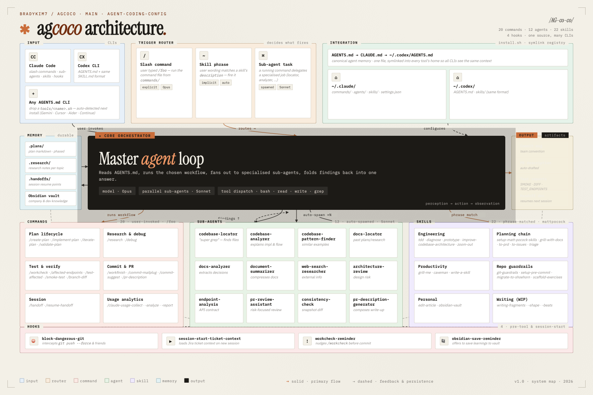

## 빠른 시작

```bash
git clone <repo-url> ~/agcoco
cd ~/agcoco
./install.sh
```

## 동작 방식

워크플로우를 발화하는 세 가지 방식 — 사용자가 입력하는 슬래시 커맨드, 문구로 자동 발화되는 스킬, 또는 커맨드가 내부에서 spawn 하는 서브 에이전트. 코어 에이전트 루프가 컨텍스트를 읽고, 계획을 세우고, 전문 에이전트로 분산시킨 뒤, 결과를 하나의 답변으로 합칩니다.

- **Commands** (`/foo`) — 사용자가 명시 호출. 전체 워크플로우.
- **Skills** — 사용자 문구가 `description` 필드와 매치되면 자동 발화. 슬래시 불필요.
- **Agents** — Claude 가 커맨드 안에서 자동 spawn. 전문화된 단일 작업.

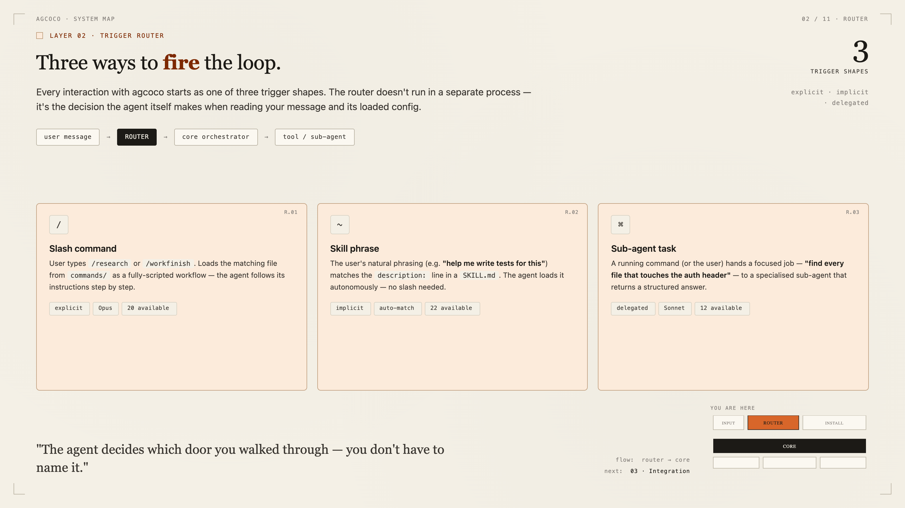

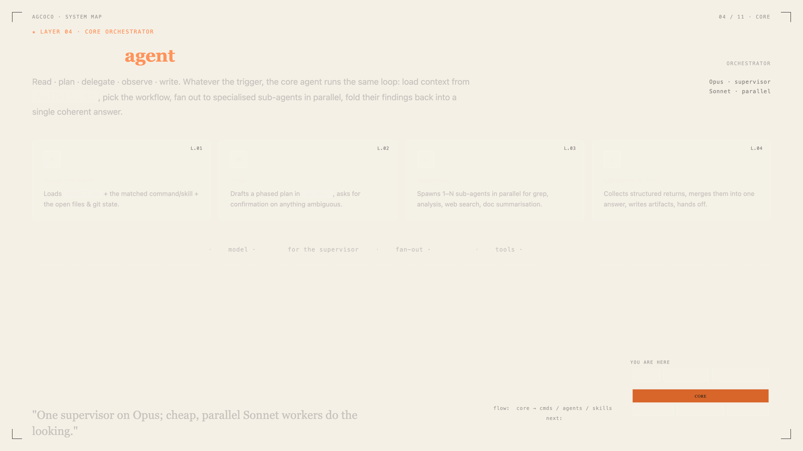

## 포함 내용

### Commands (21개)

| 카테고리 | 커맨드 |
|----------|--------|
| **계획 라이프사이클** | `/create-plan`, `/implement-plan`, `/iterate-plan`, `/validate-plan` |
| **리서치 & 디버그** | `/research`, `/debug` |
| **세션** | `/handoff`, `/resume-handoff` |
| **테스트** | `/workcheck`, `/affected-endpoints`, `/smoke-test`, `/branch-diff`, `/test-affected` |
| **커밋 & PR** | `/workfinish`, `/commit-mailplug`, `/commit-suggest`, `/pr-description` |
| **Claude 사용량** | `/claude-usage-collect`, `/claude-usage-analyze`, `/claude-usage-report` |
| **Jira 자동화** | `/jira-daily` (+ 선택적 `scripts/jira-daily-setup.sh` launchd cron) |

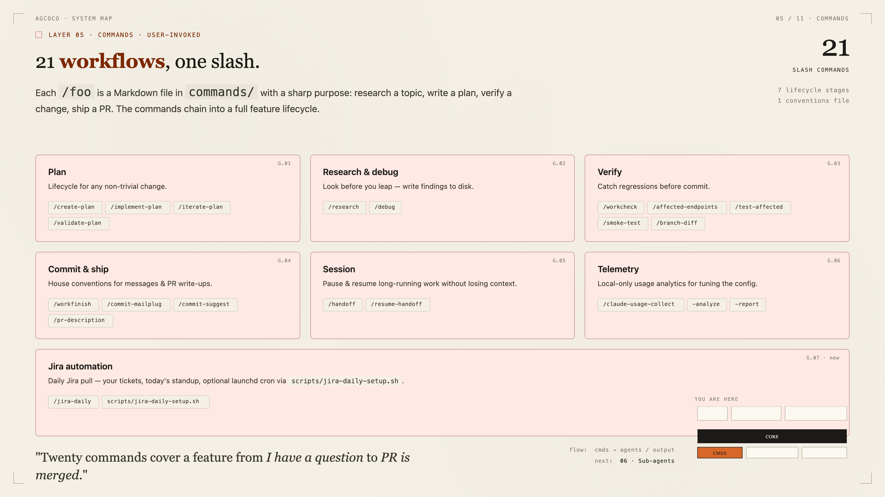

### Agents (12개)

커맨드가 자동으로 호출 — 직접 부르지 않습니다.

| 에이전트 | 역할 |
|----------|------|
| `codebase-analyzer` | 코드 구현 분석 |
| `codebase-locator` | 파일/컴포넌트 위치 찾기 (Super Grep) |
| `codebase-pattern-finder` | 유사 패턴 + 코드 예제 |
| `docs-locator` | 과거 plans/research/handoffs 검색 |
| `docs-analyzer` | 과거 문서에서 인사이트 추출 |
| `web-search-researcher` | 최신 정보 웹 검색 |
| `architecture-review` | 아키텍처 리스크 분석 |
| `endpoint-analysis` | API 엔드포인트 동작 분석 |
| `pr-review-assistant` | PR 리스크 중심 리뷰 |
| `consistency-check` | 데이터 스냅샷 비교 |
| `document-summarizer` | 문서 요약 |
| `pr-description-generator` | PR 설명 생성 |

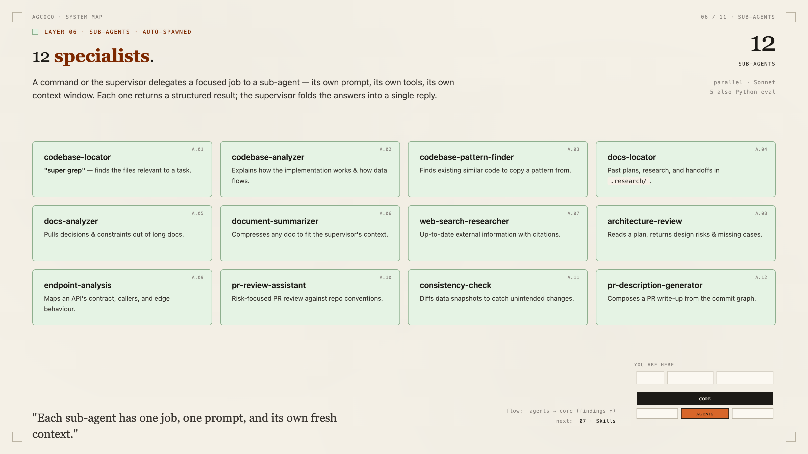

### Skills (22개)

[mattpocock/skills](https://github.com/mattpocock/skills) (MIT) 에서 포팅. 사용자 문구가 스킬의 `description` 필드와 매치되면 자동 발화 — 슬래시 커맨드 불필요.

| 카테고리 | 스킬 | 발화 문구 |
|----------|------|-----------|
| **engineering** | `setup-matt-pocock-skills` | "set up the engineering skills for this repo" — 새 프로젝트에서 먼저 실행 |
| | `grill-with-docs` | "stress-test this plan against our domain model" |
| | `to-prd` | "turn this conversation into a PRD" |
| | `to-issues` | "break this plan into issues" |
| | `triage` | "triage these incoming issues" |
| | `tdd` | "let's TDD this", "red-green-refactor" |
| | `diagnose` | "diagnose this bug", "this is broken/throwing/failing" |
| | `improve-codebase-architecture` | "find refactoring opportunities", "improve architecture" |
| | `prototype` | "let me prototype this", "try a few UI variations" |
| | `zoom-out` | "zoom out", "give me the bigger picture" |
| **productivity** | `grill-me` | "grill me on this plan", "interview me" |
| | `caveman` | (간결 출력 모드) |
| | `write-a-skill` | "create a new skill" |
| **misc** | `git-guardrails-claude-code` | "block dangerous git commands", "add git safety hooks" |
| | `setup-pre-commit` | "set up pre-commit hooks", "add Husky + lint-staged" |
| | `migrate-to-shoehorn` | "replace `as` with shoehorn in tests" |
| | `scaffold-exercises` | "scaffold an exercise structure" |
| **personal** | `edit-article` | "edit/revise this article" |
| | `obsidian-vault` | "find/create a note in Obsidian" |
| **in-progress** | `writing-fragments` | "ideate", "fragments", "raw material" |
| | `writing-shape` | "shape these notes into an article" |
| | `writing-beats` | "assemble this as a narrative" |

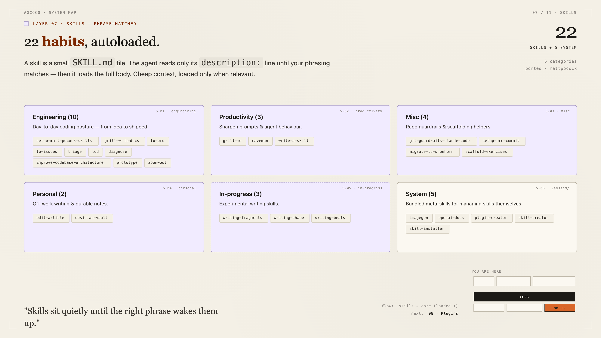

### Plugins (6개)

커맨드와 스킬은 `plugins/` 내 설치 가능한 플러그인 팩으로도 제공. 원하는 팩만 선택 가능 — 전체 config 채택 불필요.

```bash
/plugin marketplace add mskim/Agcoco
/plugin install engineering-skills@agcoco
/plugin install workflow@agcoco
```

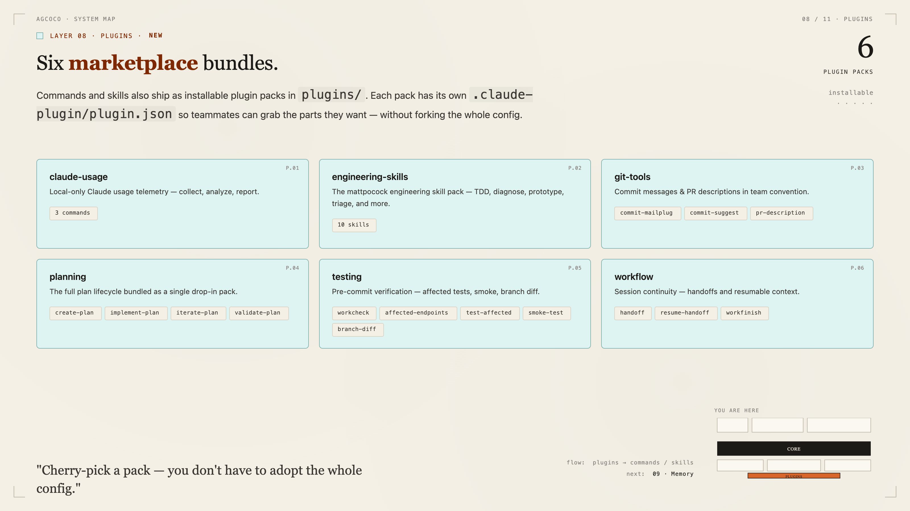

### Hooks (4개)

도구 호출 또는 세션 이벤트에서 실행되는 비-LLM 스크립트. 에이전트가 무시할 수 없음 — 런타임이 강제.

| Hook | 이벤트 | 용도 |
|------|--------|------|
| `block-dangerous-git.sh` | PreToolUse: Bash | `git commit/push/filter-repo/reset --hard` 차단 — 사람 승인 필요 |
| `workcheck-reminder.sh` | PreToolUse: Bash | 스모크 테스트 리포트 없이 커밋 시 경고 |
| `session-start-ticket-context.sh` | SessionStart | JIRA 티켓 브랜치에서 `.plans/`, `.handoffs/`, `.research/` 자동 로드 |
| `obsidian-save-reminder.sh` | Stop | 학습 내용 Obsidian 볼트 저장 유도 |

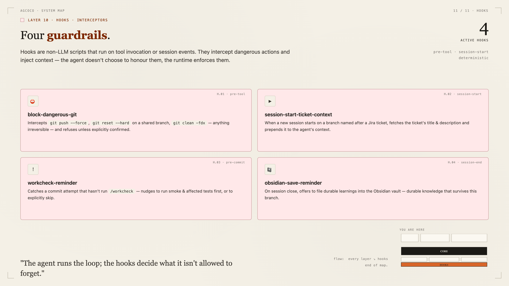

## 멀티 툴 지원 (`tools/` 레지스트리)

도구 종속이 없는 — `install.sh` 가 `tools/*.sh` 를 일반 루프로 순회하며 설치된 CLI 자동 감지 후 선언된 심링크 생성. `AGENTS.md` 가 **표준 (canonical)** 에이전트 컨텍스트 (openclaw 패턴); 각 도구의 메모리 파일명은 이 파일을 가리키는 심링크.

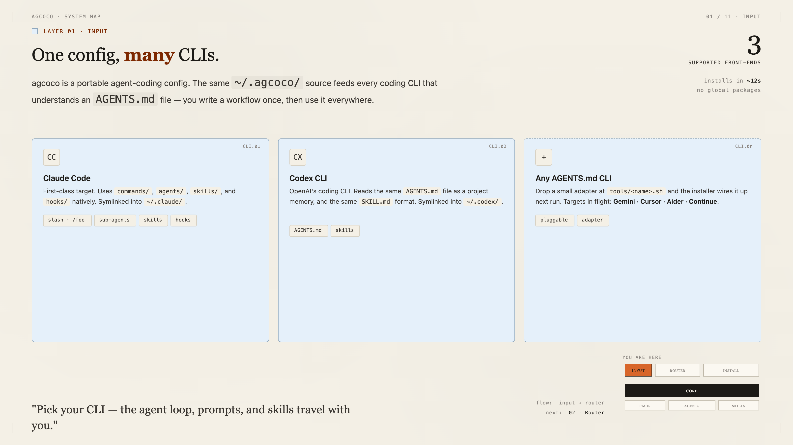

**기본 제공 (검증됨):**

| 파일 | 도구 | 감지 | 생성 심링크 |
|------|------|------|-------------|
| `tools/claude.sh` | Claude Code | `command -v claude` | `~/.claude/CLAUDE.md` → `AGENTS.md`, `commands`, `agents`, `skills`, `settings.json` |
| `tools/codex.sh` | Codex CLI | `command -v codex` | `~/.codex/AGENTS.md` → `AGENTS.md`, `skills` (동일 SKILL.md 포맷) |

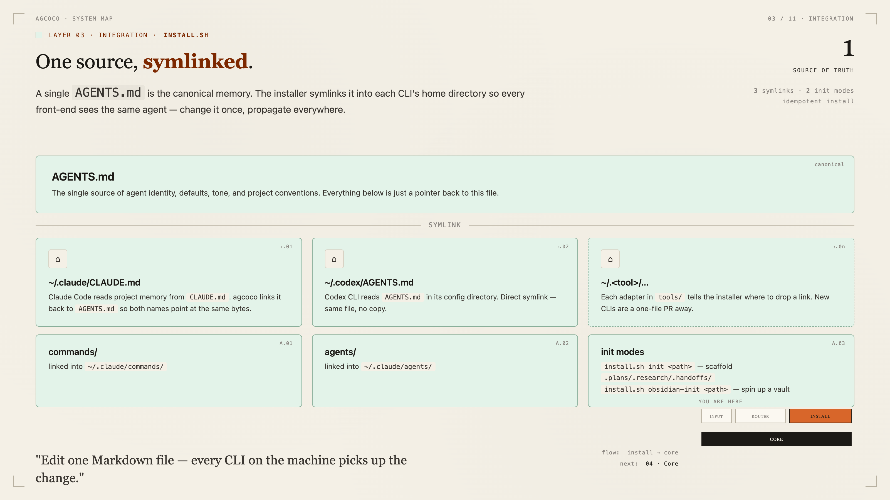

**다른 도구 추가** — Gemini, Cursor agent, Aider, Continue 등:

```bash
cp tools/_template.sh tools/<your-tool>.sh
$EDITOR tools/<your-tool>.sh    # 4개 변수 입력: TOOL_NAME, TOOL_CMD, TOOL_DIR, TOOL_SYMLINKS
./install.sh                    # 다음 실행부터 자동 감지
```

`_template.sh` 에 Gemini, Cursor, Aider, Continue 예제 정의가 주석 처리되어 있음. 컨벤션 상세는 `tools/README.md` 참조. CLI 가 설치되지 않은 도구는 "건너뛴 툴" 에 표시되고 조용히 스킵.

## 메모리 & 상태

디스크 위의 플레인 마크다운이 메모리. 계획서, 리서치 노트, 핸드오프가 파일로 존재해 다음 세션, 다음 브랜치, 다른 머신에서도 에이전트가 읽을 수 있음 — 컨텍스트가 채팅 윈도우를 넘어 생존.

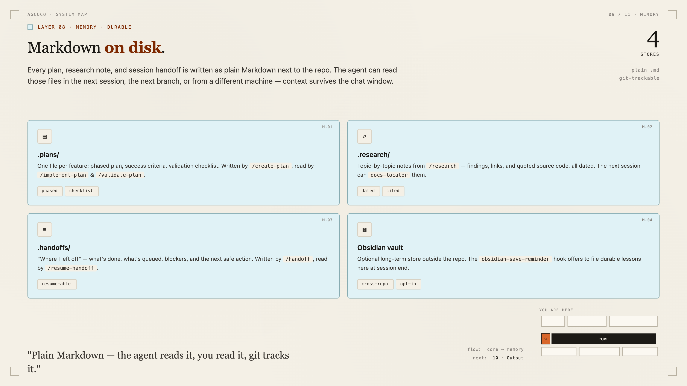

### 프로젝트 초기화

```bash
./install.sh init /path/to/project
```

대상 프로젝트에 `CLAUDE.md` + `.handoffs/` + `.plans/` + `.research/` 생성.

### Obsidian 볼트 초기화

회사 지식 + 개발 지식 축적용 Obsidian 볼트를 부트스트랩.

```bash
./install.sh obsidian-init ~/Documents/MyVault
```

생성 항목:
- 폴더 구조 (`20-Company/` 회사 지식, `30-Development/` 개발 지식 분리)
- 7가지 노트 템플릿 (데일리·미팅·ADR·기술 지식·트러블슈팅·용어집·주간 회고)
- Claude Code 연동 (`CLAUDE.md` + `.claude/commands/` 슬래시 커맨드 3종)
- Obsidian 코어 플러그인 자동 설정

→ [Obsidian Onboarding Guide](docs/obsidian-onboarding.md) 따라하기 (10분)

## 출력

모든 워크플로우는 채팅 답변이 아닌 구체적인 파일 또는 메시지를 생성. 커밋 메시지는 팀 컨벤션을 따르고, PR 설명은 자동 생성되며, 테스트 리포트는 다음 세션이 읽을 수 있도록 체크인.

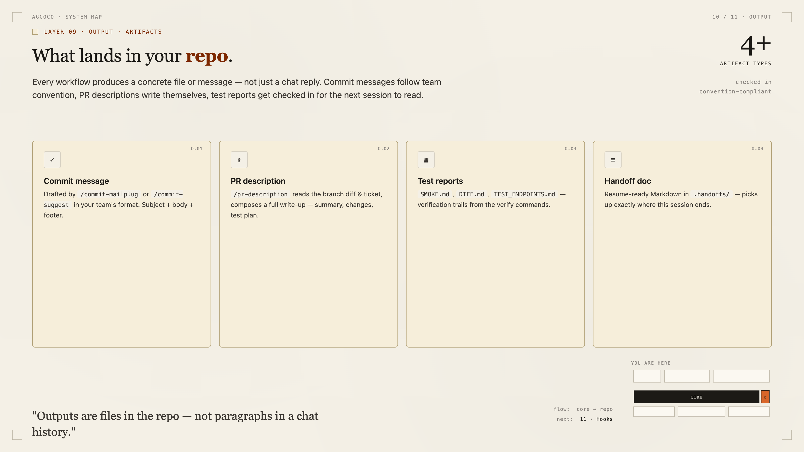

## 문서

### 컴포넌트 레퍼런스
- [슬래시 커맨드](docs/commands.kr.md) ([EN](docs/commands.en.md)) — 카테고리별 21개 커맨드
- [서브 에이전트](docs/agents.kr.md) ([EN](docs/agents.en.md)) — Claude 가 spawn 하는 12개 전문 에이전트
- [Hooks](docs/hooks.kr.md) ([EN](docs/hooks.en.md)) — 4개 라이프사이클 hook 스크립트
- [Scripts](docs/scripts.kr.md) ([EN](docs/scripts.en.md)) — 독립 실행 셸 헬퍼
- [Plugins](docs/plugins.kr.md) ([EN](docs/plugins.en.md)) — 6개 플러그인 마켓플레이스 번들

### 가이드
- [Onboarding Guide](docs/onboarding.md) — 처음 사용자를 위한 소개
- [Obsidian Onboarding](docs/obsidian-onboarding.md) — Obsidian 볼트 단계별 셋업
- [Workflow Reference](WORKFLOW.md) — 전체 커맨드 & 워크플로우 상세
- [Submodule Approach](docs/approach-a-submodule.md) — 팀 공유 시 대안 구조

## 영감받은 곳

- [humanlayer/humanlayer](https://github.com/humanlayer/humanlayer) `.claude/` 구조
